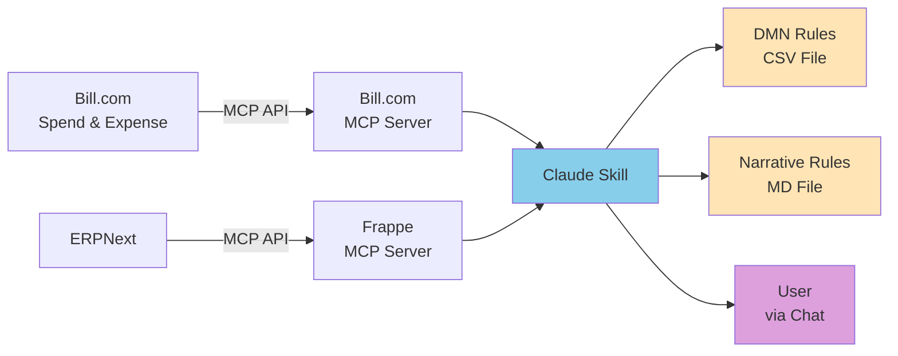
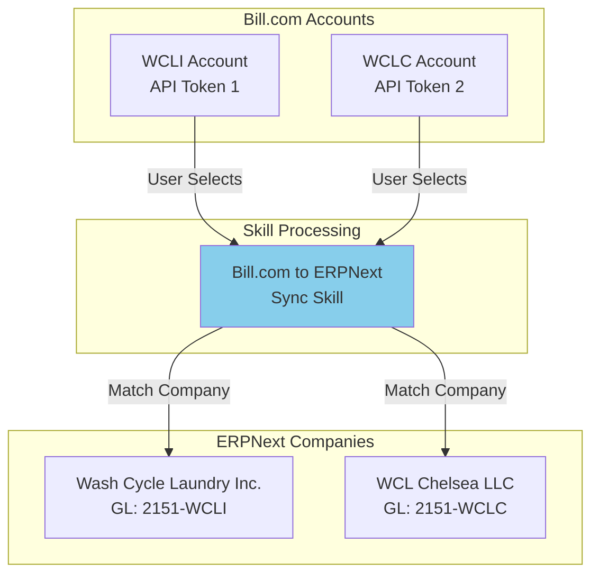
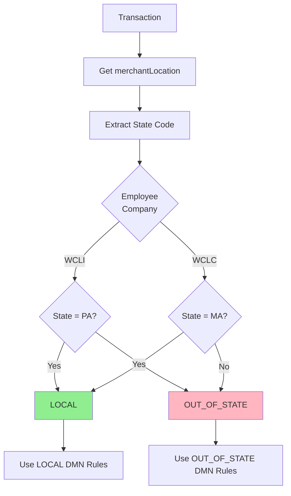
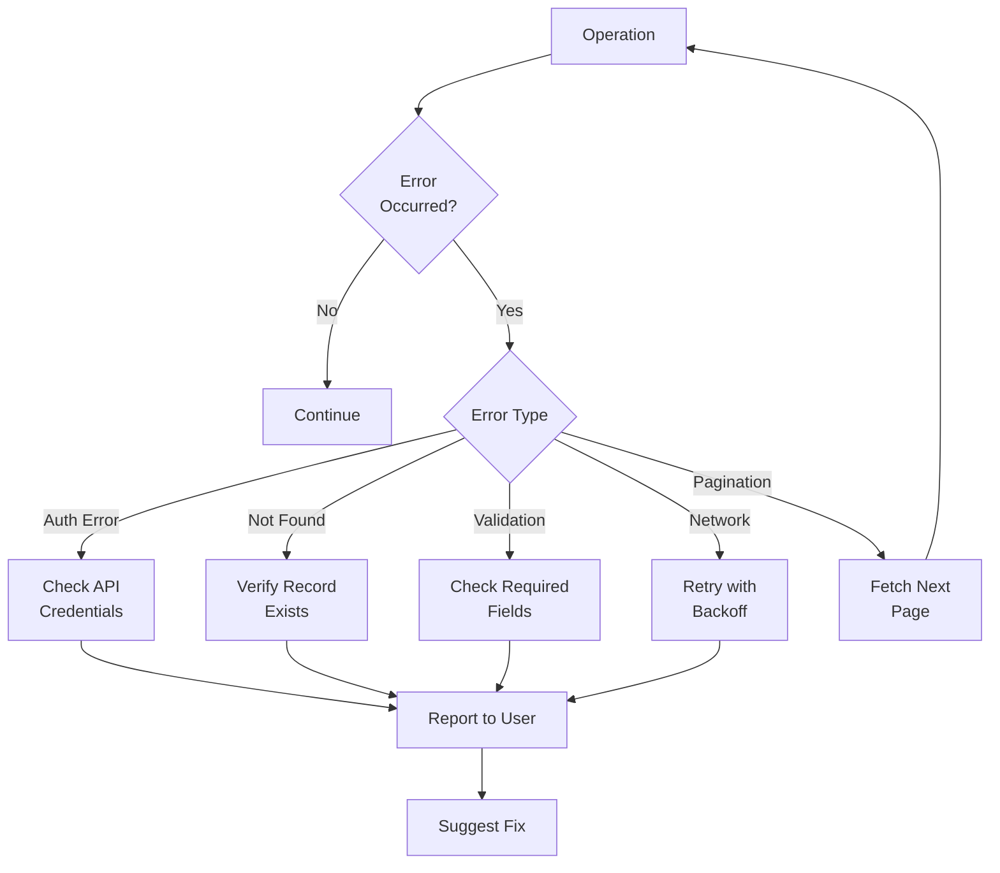

# Bill.com to ERPNext Sync - Workflow Diagram

This file contains Mermaid diagrams showing the skill workflow.

## High-Level Workflow

```mermaid
graph TD
    A[Start: User requests sync] --> B[Select Company<br/>WCLI or WCLC]
    B --> C[Confirm Date Range<br/>Default: Last Week]
    C --> D[Fetch Transactions<br/>from Bill.com]
    D --> E{Handle<br/>Pagination?}
    E -->|More Pages| D
    E -->|Complete| F[Enrich with<br/>Employee Data]
    F --> G[Apply DMN Rules]
    G --> H[LLM Classification<br/>for Non-Matches]
    H --> I[Present Results<br/>Grouped by Confidence]
    I --> J[User Reviews<br/>REVIEW Items]
    J --> K[Create Journal<br/>Entries in ERPNext]
    K --> L[Run Reconciliation<br/>Check]
    L --> M{Balanced?}
    M -->|Yes| N[✅ Complete]
    M -->|No| O[⚠️ Report Discrepancies]
```

## Classification Decision Flow

```mermaid
graph TD
    A[Transaction] --> B{Matches<br/>DMN Rule?}
    B -->|Yes| C{Rule Action}
    C -->|AUTO_POST| D[✅ Auto-Classify]
    C -->|REVIEW| E[⚠️ Flag for Review]
    C -->|REJECT| F[🚩 Reject - Manual Handling]
    
    B -->|No| G[LLM Classification]
    G --> H{Confidence<br/>Level?}
    H -->|>90%| D
    H -->|70-90%| E
    H -->|<70%| E
```

## DMN Rule Evaluation

```mermaid
graph LR
    A[Transaction Data] --> B{Merchant<br/>Pattern?}
    B -->|Match| C{MCC<br/>Code?}
    B -->|No Match| Z[Next Rule]
    C -->|Match| D{Amount<br/>Range?}
    C -->|No Match| Z
    D -->|Match| E{User<br/>Team?}
    D -->|No Match| Z
    E -->|Match| F{State<br/>Match?}
    E -->|No Match| Z
    F -->|Match| G[✅ Rule Matches<br/>Apply GL Account]
    F -->|No Match| Z
    
    style G fill:#90EE90
    style Z fill:#FFB6C1
```

## Journal Entry Creation

```mermaid
graph TD
    A[Approved Transaction] --> B[Prepare Journal Entry]
    B --> C[Set Posting Date<br/>from Transaction]
    C --> D[Create Debit Entry<br/>to Expense GL Account]
    D --> E[Create Credit Entry<br/>to CC Liability Account]
    E --> F{Company}
    F -->|WCLI| G[2151 - Divvy CC - WCLI]
    F -->|WCLC| H[2151 - Divvy CC - WCLC]
    G --> I[Post to ERPNext]
    H --> I
    I --> J{Success?}
    J -->|Yes| K[✅ JE Created]
    J -->|No| L[❌ Report Error]
```

## Reconciliation Process

```mermaid
graph TD
    A[Reconciliation Start] --> B[Sum Bill.com<br/>Transaction Amounts]
    B --> C[Query ERPNext<br/>Journal Entries]
    C --> D[Filter to CC<br/>Liability Account]
    D --> E[Sum Credit Amounts]
    E --> F{Amounts<br/>Match?}
    F -->|Yes<br/>Diff < $1| G[✅ Reconciled]
    F -->|No<br/>Diff > $1| H[⚠️ Out of Balance]
    H --> I[List Discrepancies]
    I --> J[Suggest Next Steps]
```

## Data Flow Architecture

## Multi-Entity Architecture

## Transaction State Determination

## Error Handling Flow

## User Interaction Flow

```mermaid
sequenceDiagram
    participant U as User
    participant C as Claude (Skill)
    participant B as Bill.com MCP
    participant E as ERPNext MCP
    
    U->>C: Sync transactions
    C->>U: Which company?
    U->>C: WCLI
    C->>U: Date range? (default last week)
    U->>C: Confirm
    C->>B: list_transactions_enriched()
    B->>C: Transaction data
    C->>E: list_documents(Employee)
    E->>C: Employee data
    C->>C: Apply DMN + LLM classification
    C->>U: Present results (AUTO/REVIEW/REJECT)
    U->>C: Confirm/adjust REVIEW items
    C->>E: create_document(Journal Entry) × N
    E->>C: Success/failure per JE
    C->>E: list_documents(Journal Entry)
    E->>C: JE data for reconciliation
    C->>U: ✅ Complete + Reconciliation report
```

---

## How to View These Diagrams

### In Claude
Just ask Claude to show you any of these diagrams. Claude can render Mermaid diagrams directly.

Example: "Show me the high-level workflow diagram"

### In Markdown Viewers
Most modern markdown viewers (GitHub, GitLab, VS Code, etc.) support Mermaid diagrams natively.

### Online
Copy any diagram block and paste into:
- https://mermaid.live/
- https://mermaid-js.github.io/mermaid-live-editor/

### Editing
To modify these diagrams:
1. Copy the Mermaid code
2. Edit in mermaid.live
3. Paste back here when satisfied
